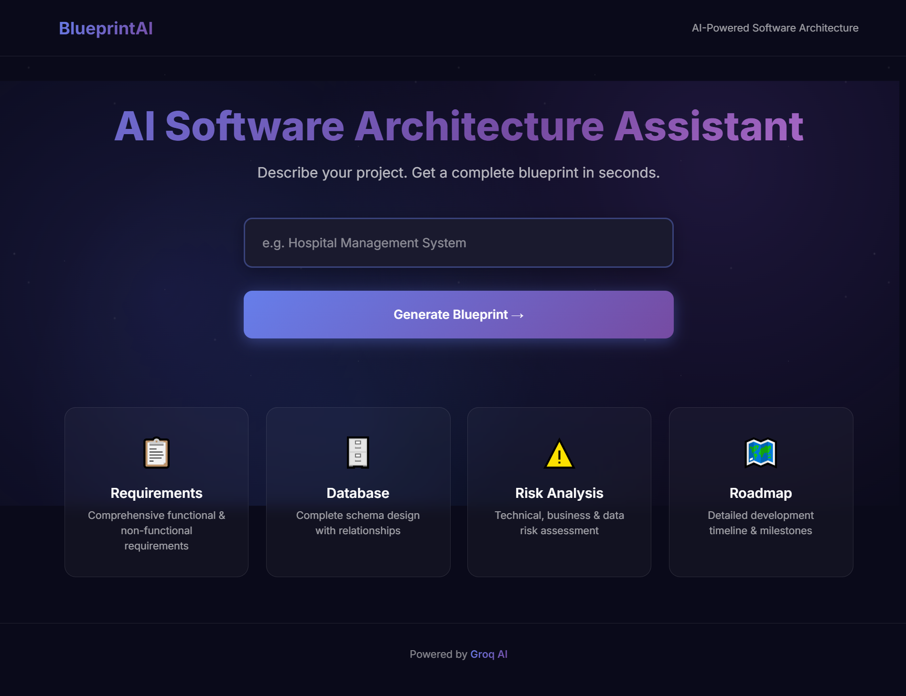
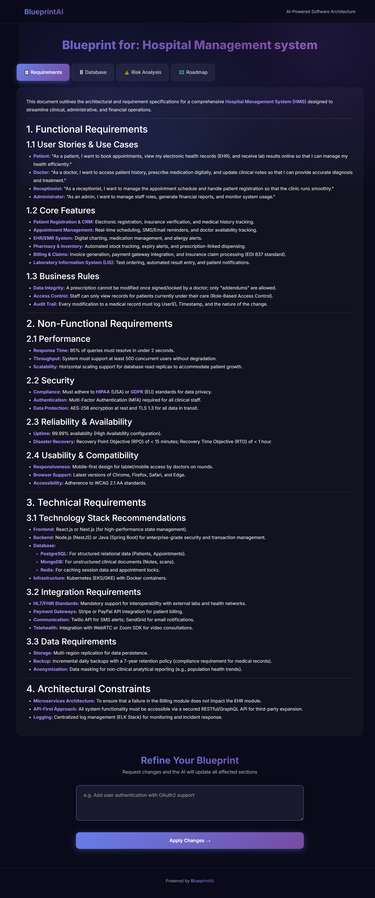

# Software Blueprint AI

### Multi-Agent Software Architect

Software Blueprint AI is an AI-powered multi-agent system that transforms a simple project idea into a complete software architecture blueprint. The platform automatically generates requirements, database designs, risk assessments, and development roadmaps using specialized AI agents powered by Google Gemini.

## 🚀 Live Demo
👉 [Try it here](https://ahsanbilal.pythonanywhere.com)
---

## Features

* Generate complete software blueprints from project ideas
* Functional and non-functional requirements generation
* Database schema and relationship design
* Risk analysis and mitigation planning
* Development roadmap generation
* Natural language blueprint refinement
* Multi-agent AI architecture
* Modern Flask-based web interface

---

## Agent Pipeline

### Requirement Agent

Generates functional and non-functional requirements based on the project description.

### Database Agent

Designs database tables and relationships from the generated requirements.

### Risk Agent

Identifies technical, operational, and security risks with mitigation strategies.

### Roadmap Agent

Creates a phased implementation roadmap and development plan.

### Refinement Agent

Updates and improves generated blueprints based on user feedback.

---

## Tech Stack

### Backend

* Python
* Flask

### AI

* Google Gemini API (gemini-3.1-flash-lite)

### Frontend

* HTML5
* CSS3
* Bootstrap
* Markdown Rendering

### Architecture

* Multi-Agent AI Pipeline

---

## Installation

### Clone Repository

```bash
git clone https://github.com/im-ahsanbilal/software-blueprint-ai.git
cd software-blueprint-ai
```

### Create Virtual Environment

```bash
python -m venv venv
```

### Activate Virtual Environment

```bash
venv\Scripts\activate
```

### Install Dependencies

```bash
pip install -r requirements.txt
```

### Configure Environment Variables

Create a `.env` file in the root directory:

```env
GEMINI_API_KEY=your_gemini_api_key_here
```

### Run Application

```bash
python app.py
```

Open:

```text
http://127.0.0.1:5000
```

---

## Screenshots

### Home Page



### Generated Blueprint



---

## Future Enhancements

* API Architecture Agent
* Architecture Diagram Generation
* PDF Export
* Blueprint History
* Cloud Deployment

---

## Author

**Muhammad Ahsan**

GitHub: https://github.com/im-ahsanbilal

Portfolio: https://imahsanbilal.pythonanywhere.com
